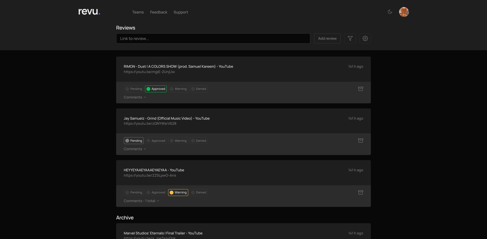

In progress: a real-life web application for live streamers (Twitch, YouTube, etc.) to organize their moderators to review video reactions to prevent strikes and a potential bans. 

Check out the current state: https://www.revulab.app/

```bash
# Demo Account
E-Mail: demo@revulab.app
Password: Demo123!
```



## Getting Started

Make sure to copy and fill a dotenv variables from `.env.public` and to move your firebase admin credentials to `/app/lib/firebase/keys`.

Run the development server:

```bash
npm run dev
# or
yarn dev
```

Open [http://localhost:3000](http://localhost:3000) with your browser to see the result.

The `pages/api` directory is mapped to `/api/*`. Files in this directory are treated as [API routes](https://nextjs.org/docs/api-routes/introduction) instead of React pages.
